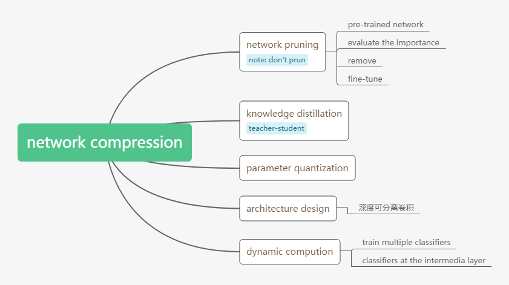
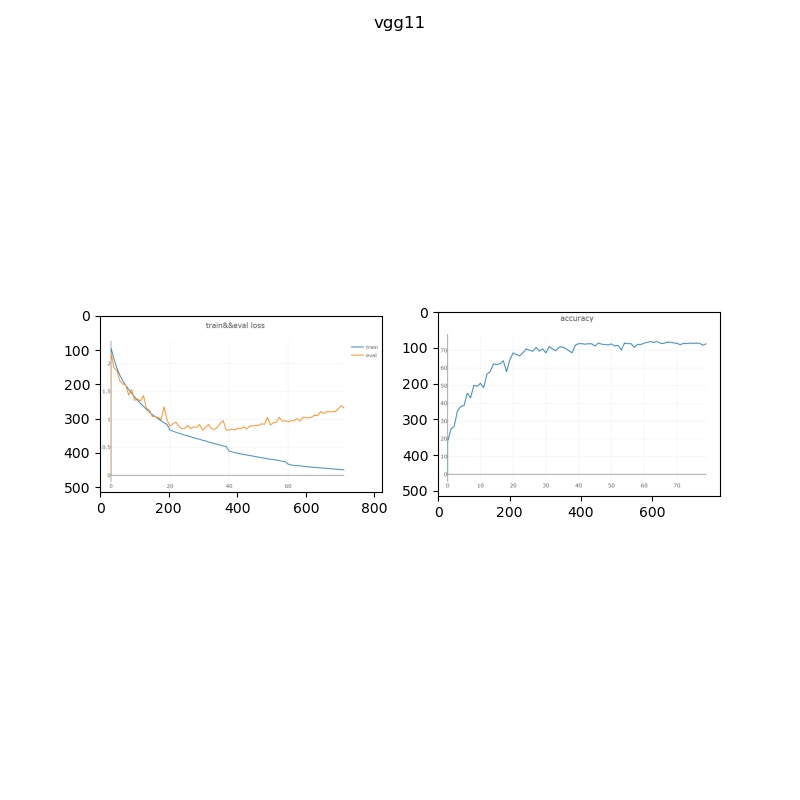
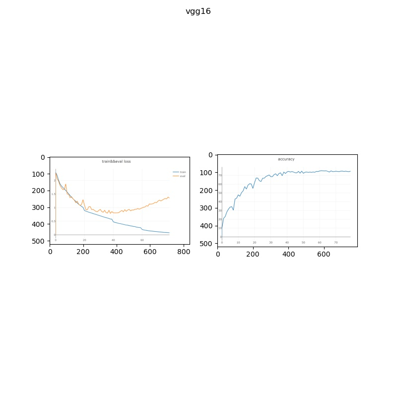

# minic-learning
一般我们都将神经网络放置到服务器上进行训练，所以在搭建和训练神经网络的时候并没有考虑到计算器资源的大小等等。但是当我们需将模型落地到某一硬件设施之中，如机器人或手机，设备的存储容量以及算力就成为模型的限制因素。为了使得模型能够嵌入到某一设备之中，我们通常会将模型进行压缩。压缩的方法主要有以下几种：  
  
在该项目中，我采用了第二种方法--知识蒸馏，来压缩网络模型的大小。在这里，我首先使用cifar10数据集来训练一个较大的网络。之后，我再使用teacher-student的模式来训练一个较小的网络。teacher-student模式模仿了老师与学生的关系，将teacher model所学到的知识教授给student model。在teacher-studet训练模型中，模型的训练空间不再是label space，而是logits space或者是probability space。据研究，模型在logits space或probability space更加容易训练。而且在logits space或probability space上，student model不再只学习到单一的标签信息，而会学习到多样的有效信息 。如teacher model给出的概率分布不仅会告诉student model输入的label还是告诉其input与其它label对应input的相似度，丰富了student model的知识。
# Environment
python 3.7  
pytorch 1.5  
torchvision 0.6  
opencv 3.4
# Experiment
实验分为三组：训练vgg11网络，训练vgg16网络和使用vgg16作为teacher model来训练vgg11网络。为了提高vgg16的泛化能力，使得vgg16和vgg11两者之间有明显的差别，我使用了pytorch中vgg16的预训练模型来初始化vgg16的参数。三组实验的实验数据分别如下所示，在训练过程中，三者使用相同的超参数设定。  
  
  
  
从上述的实验可知，与一般方法训练的vgg11相比，使用teacher-student模式训练的vgg11在精度上提高了2%左右。但是由于vgg11模型在cifar10数据集上本身就能够work，因为其train loss处于下降的趋势。所以，该实验并无法验证teacher-student的训练方法能够降低模型的训练难度。所以，接下来我想或许我们能够使用一个更加浅的网络来充当student网络来验证teacher-student的实用性。
